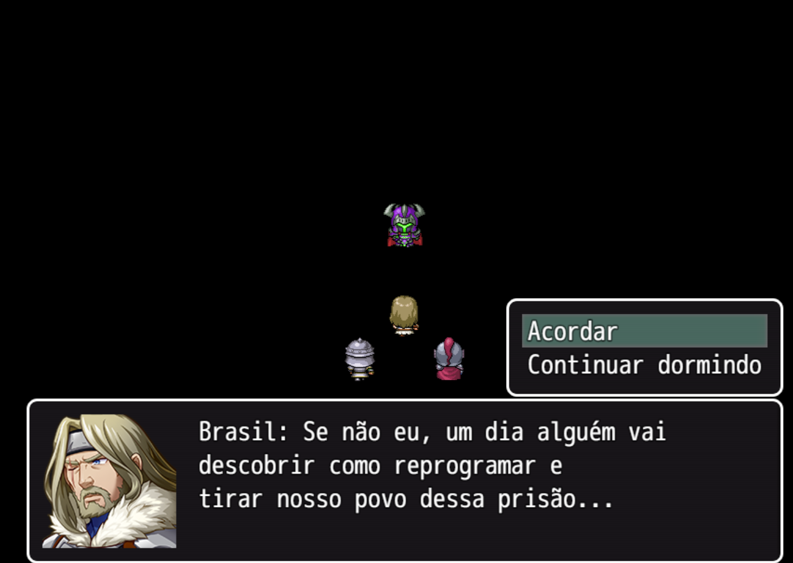
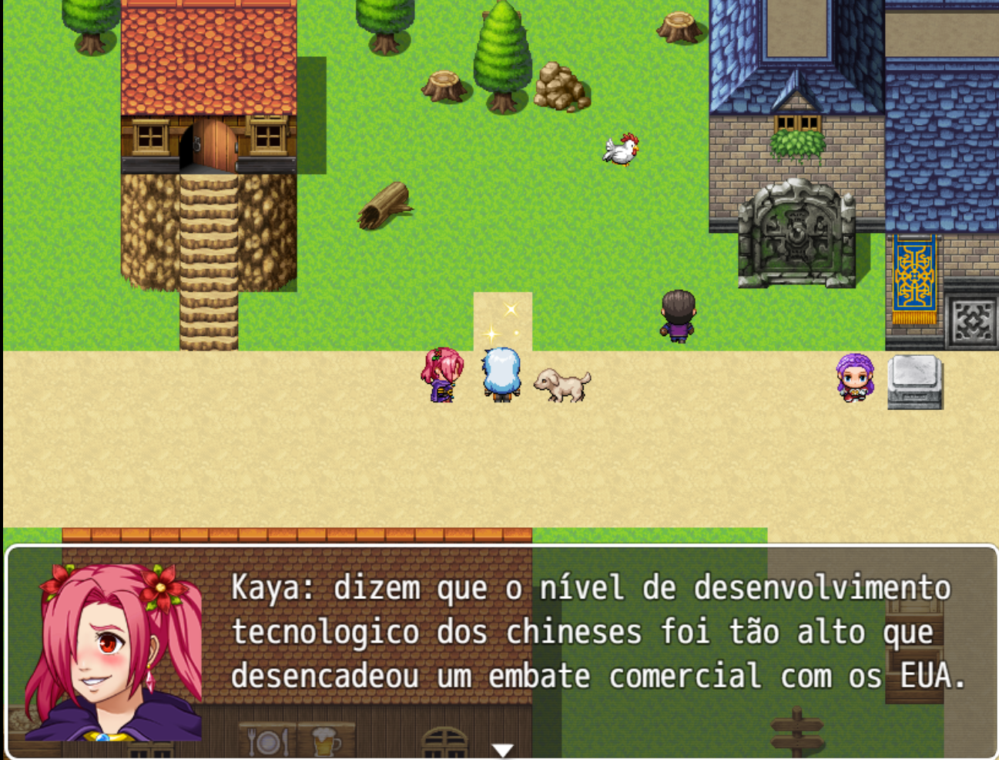
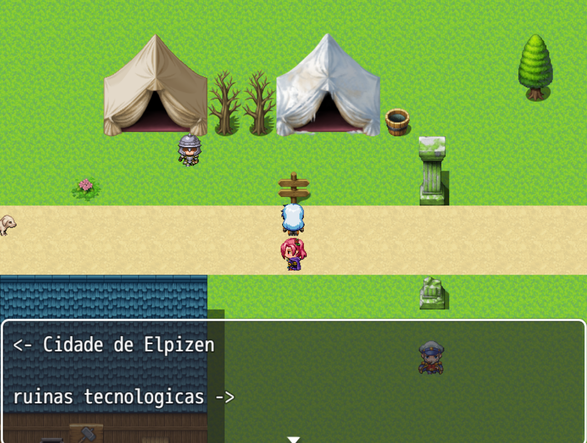
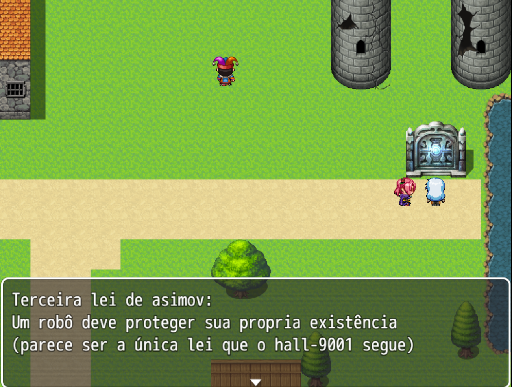
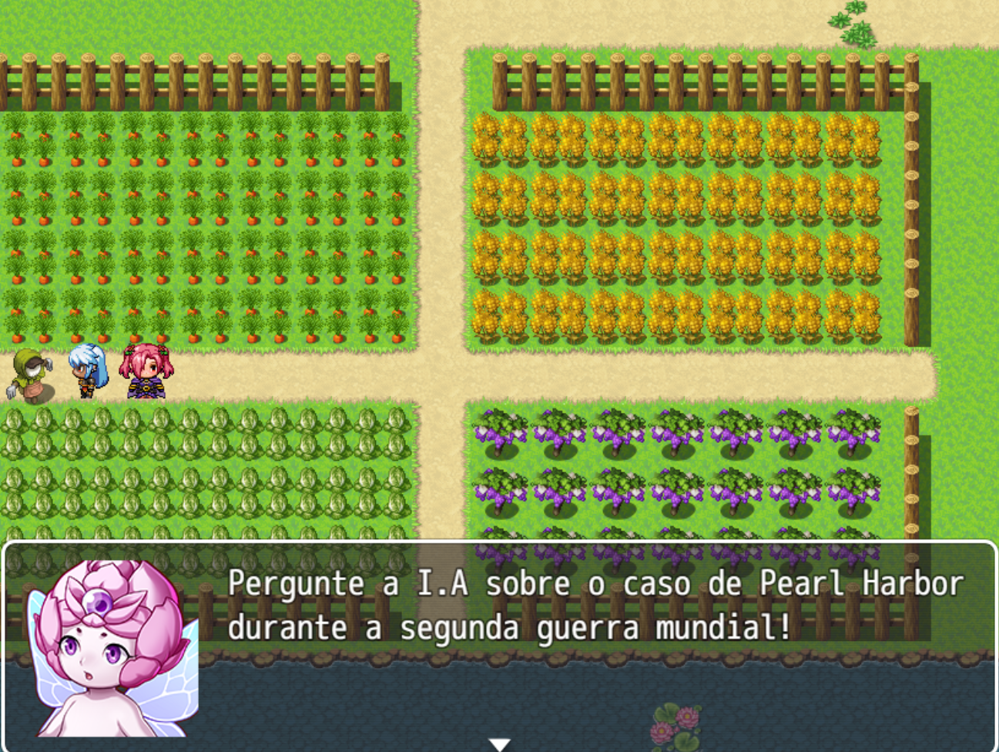
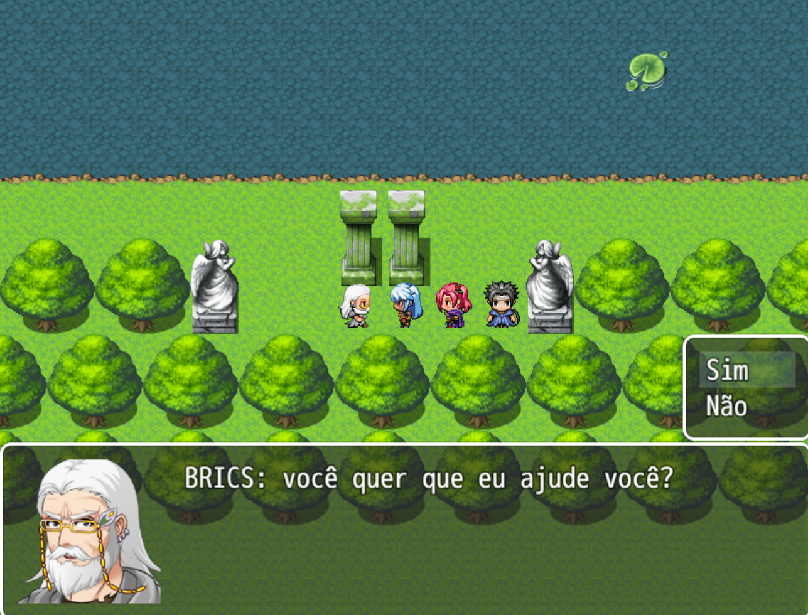
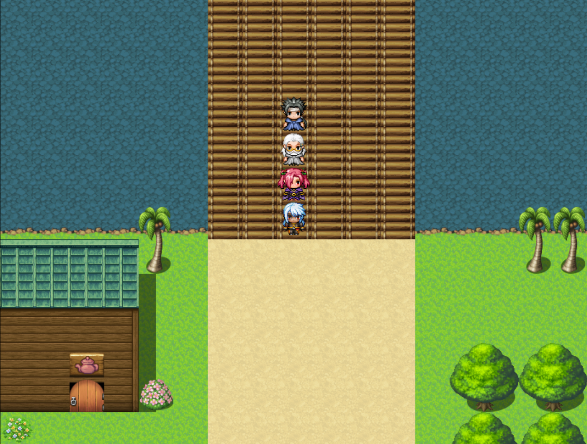
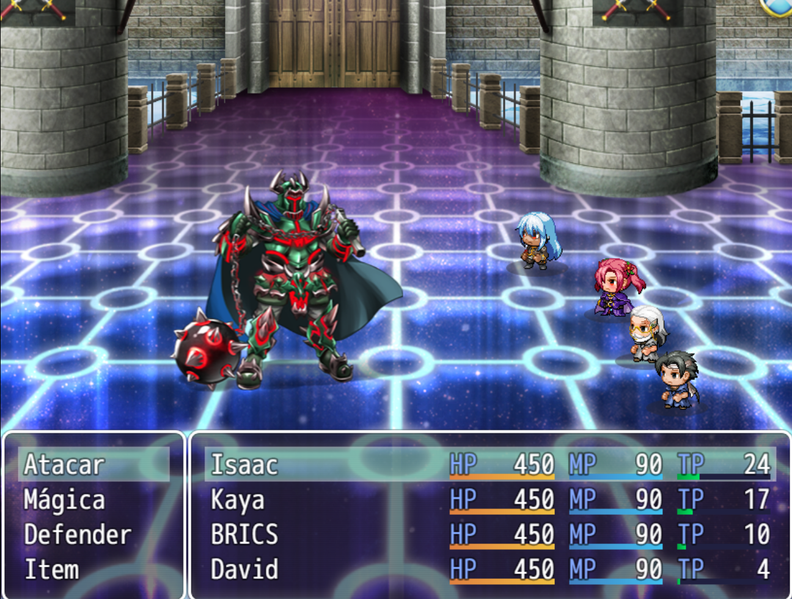
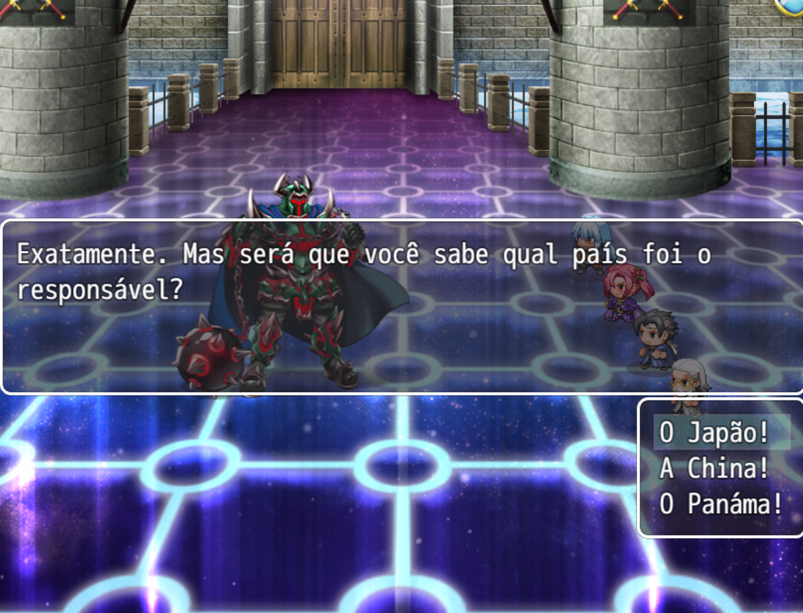

# Game - leis de Asimov 

**Contexto Acadêmico:**
Projeto desenvolvido para a disciplina IMD0522 - Jogos Digitais como Ferramenta Pedagógica (2024.2) na Universidade Federal do Rio Grande do Norte (UFRN).

## 🎯 Objetivo
Tem como proposito o ensino da geopolítica contemporânea para alunos do fundamental II (especificamente do nono ano)

## 📖 Sinopse
O jogo retrata o cotidiano de uma sociedade tribal em um futuro pós-apocalíptico que vivem confinada em uma prisão estufa. Para alcançar a maturidade, os membros devem realizar um rito de passagem: entrar em uma sala-bunker do antigo mundo tecnológico e enfrentar uma inteligência artificial militar que descumpre as duas primeiras leis de Asimov ("um robô não pode ferir um humano" e "os robôs devem obedecer às ordens dos humanos"). O objetivo do protagonista é, através de tentativa e erro, completar o desafio da máquina para desativar a terceira lei ("um robô deve proteger sua própria existência") e abrir a porta que tranca a comunidade na prisão-estufa.

## ✨ Mecânicas e Características
* **Gênero:** RPG, Fantasia, educativo, narrativo, estratégia.
* **Sistema de Escolhas:** Diálogos com NPCs e um rival que definem a visão de mundo do jogador no universo.
* **Recrutamento de Equipe:** É possível recrutar a irmã do protagonista, o rival e o mascote da tribo (cachorro) para auxiliar na gameplay e trazer dinamicidade aos combates.
* **Finais Múltiplos:** Escolha entre destruir a IA e viver em paz na estufa, ou reprogramá-la para servir como um guia de conhecimento ilimitado para o povo.
* **Engine:** RPG Maker MV.

## 👥 Personagens Principais
* **Protagonista:** Jovem destemido com design inspirado no Link da franquia Zelda.
* **Irmã:** Guerreira com cicatrizes do rito de passagem, figura de suporte emocional inspirada na Anna de Epic Battle Fantasy V.
* **Rival:** Design semelhante ao Crono de Chrono Trigger.
* **Mascote da Tribo:** Inspirado no Lupi de Enigma do Medo.

## 💻 Requisitos do Sistema
* **Sistema Operacional:** Windows
* **Memória:** 2 GB RAM
* **Gráficos:** DirectX 8
* **Processador:** Intel Celeron
* **Armazenamento:** 500 MB de espaço livre

## 🚀 Como Jogar
1. Faça o download dos arquivos do jogo através do nosso repositório no Google Drive: [Download via Google Drive](https://drive.google.com/drive/u/0/folders/1UV51wTc0H92MB9i7J9um2BKmWjMUPYBW)
2. Extraia o arquivo baixado em uma pasta de sua preferência.
3. Execute o arquivo principal do jogo (`game leis de Asimov.exe`).

## 📸 Capturas de Tela

<table align="center">
  <tr>
    <td align="center">
       
      <em><b>A Lenda da Profecia:</b> "Se não eu, um dia alguém vai descobrir como reprogramar e tirar nosso povo dessa prisão..."</em>
    </td>
    <td align="center">
       
      <em><b>Mundo Ancestral:</b> Kaya compartilhando conhecimentos vitais sobre a antiga economia global e o embate comercial.</em>
    </td>
  </tr>
  <tr>
    <td align="center">
       
      <em><b>Exploração:</b> O caminho que deixa a segurança da Cidade de Elpizen rumo às perigosas ruínas tecnológicas.</em>
    </td>
    <td align="center">
       
      <em><b>O Mistério da Máquina:</b> A terrível descoberta de que a IA Hall-9001 protege exclusivamente a própria existência.</em>
    </td>
  </tr>
  <tr>
    <td align="center">
       
      <em><b>Segredos Históricos:</b> Coletando informações cruciais sobre eventos como a Segunda Guerra Mundial para superar os enigmas.</em>
    </td>
    <td align="center">
       
      <em><b>Aliados Poderosos:</b> O encontro com o sábio BRICS, sempre pronto para oferecer ajuda na jornada.</em>
    </td>
  </tr>
  <tr>
    <td align="center">
       
      <em><b>União de Heróis:</b> Isaac, Kaya, BRICS e David formando o grupo completo que desafiará o impossível.</em>
    </td>
    <td align="center">
       
      <em><b>Combate Estratégico:</b> O épico embate em turnos contra a armadura colossal da IA militar corrompida.</em>
    </td>
  </tr>
  <tr>
    <td align="center" colspan="2">
       
      <em><b>O Teste Final:</b> Hall-9001 desafiando a mente e a estratégia dos aventureiros com enigmas mortais sobre geopolítica global.</em>
    </td>
  </tr>
</table>
## 🛠️ Equipe de Desenvolvimento
* **Gabriel Giulian:** Game Designer e Desenvolvedor
* **Caio Gabriel:** Ilustrador / Concept e Desenvolvedor
